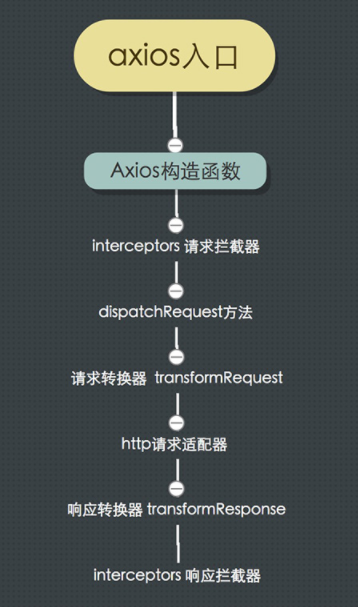
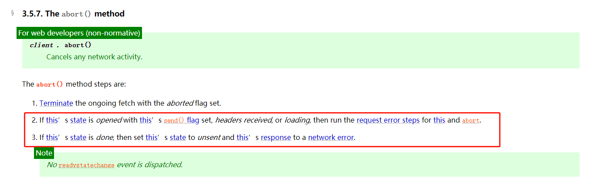

## axios目录结构


### utils.js工具函数

```js
module.exports = {
  isArray: isArray, 
  isArrayBuffer: isArrayBuffer, // 二进制字节数组 '[object ArrayBuffer]'
  isBuffer: isBuffer,
  isFormData: isFormData, // typeof val ==
  isArrayBufferView: isArrayBufferView,
  isString: isString,
  isNumber: isNumber,
  isObject: isObject,
  isPlainObject: isPlainObject, // 只有直接是Object的实例，或者null，才会返回true；无格式对象
  isUndefined: isUndefined,
  isDate: isDate, // '[object Date]'
  isFile: isFile, // '[object File]' File继承自Blob
  isBlob: isBlob, // // Binary Large Object的缩写，代表二进制类型的大对象
  isFunction: isFunction,
  isStream: isStream, // val.pipe 类似于函数组合compose
  isURLSearchParams: isURLSearchParams, // // key1=val1&key2=val2 query提取
  isStandardBrowserEnv: isStandardBrowserEnv,
  forEach: forEach,
  merge: merge, // 对象合并，相同属性'后'覆盖'前' merge(/* obj1, obj2, obj3, ... */)
  extend: extend, // 功能扩展 extend(a, b, thisArg) 扩展a，可指定上下文
  trim: trim,
  stripBOM: stripBOM //移除开头的0xFEFF
};
```

### helpers文件夹

```js
// bind.js
function bind(fn, thisArg) // es5语法实现的，而且没考虑bind时传参数，只能bind完再调用的时候传参数

// *buildURL.js
buildURL(url, params, paramsSerializer) 
/* if(!params) return url;
else 将params通过paramsSerializer(params)处理好，参数序列化，然后拼接到url后面返回 */

// combineURLs.js
function combineURLs(baseURL, relativeURL)
/* url拼接， baseURL拼接relativeURL，对使用者可能出现的baseURL末尾的'/'和relativeURL开头的'/'做处理，防止多个 */

// cookies.js
对cookie进行处理， write、read、remove方法，对cookie进行读、写、某个name的删除

// deprecatedMethod.js
function deprecatedMethod(method, instead, docs)
/* 简单地提示该方法已被废弃 */

// isAbsoluteURL.js
function isAbsoluteURL(url) {
     return /^([a-z][a-z\d\+\-\.]*:)?\/\//i.test(url); // 正则匹配 '//'，http://balabala
}

// isAxiosError.js
function isAxiosError(payload) {
     return (typeof payload === 'object') && (payload.isAxiosError === true);
}
/* 判断payload是不是axios抛出的error */

// *isURLSameOrigin.js
function isURLSameOrigin(requestURL)
/* 判断请求的url与当前页面是否同源 */

// normalizeHeaderName.js
/* 对请求的headers的name做大小写统一 */

// parseHeaders.js
function parseHeaders(headers)
/* 对头（请求头、响应头）进行处理 */

// spread.js
function spread(callback)
/* 调用函数并扩展参数数组的语法糖, 调用callback函数，并传入arr数组参数 */
```


### axios内部运作流程图



### defaults.js

#### 数据转换器

`自动转换json数据`

##### 请求转换器 transfromRequest

```js
// 发送请求前对数据做转换，不需要使用者自己转换数据格式以及对应的请求头 
/* 请求转换器的使用地方是http请求前，使用请求转换器对请求数据做处理，然后传给http请求适配器使用 */

transformRequest: [function transformRequest(data, headers) {
    normalizeHeaderName(headers, 'Accept');
    normalizeHeaderName(headers, 'Content-Type');
    if (utils.isFormData(data) ||
      utils.isArrayBuffer(data) ||
      utils.isBuffer(data) ||
      utils.isStream(data) ||
      utils.isFile(data) ||
      utils.isBlob(data)
    ) {
      return data;
    }
    if (utils.isArrayBufferView(data)) {
      return data.buffer;
    }
    if (utils.isURLSearchParams(data)) { // data是url
      setContentTypeIfUnset(headers, 'application/x-www-form-urlencoded;charset=utf-8');
      return data.toString();
    }
    if (utils.isObject(data)) { // data是obj
      setContentTypeIfUnset(headers, 'application/json;charset=utf-8');
      return JSON.stringify(data); // 请求转换器将对象转为json字符串
    }
    return data;
  }],
```

##### 响应转换器 transfromResponse

对请求响应后的响应体做数据转换

```js
// 响应转换器的使用地方是在http请求完成后，根据http请求适配器的返回值做数据转换处理

transformResponse: [function transformResponse(data) {
    var result = data;
    if (utils.isString(result) && result.length) {
      try {
        result = JSON.parse(result); // 响应转换器将字符串转为json对象
      } catch (e) { /* Ignore */ }
    }
    return result;
  }],
```

##### 转换器和拦截器的关系？

在请求时，拦截器主要负责修改config配置项，数据转换器主要负责转换请求体，比如转换对象为字符串
在请求响应后，拦截器可以拿到`response`，数据转换器主要负责处理响应体，比如转换字符串为对象。

##### timeout 

```
超时（以毫秒为单位）以中止请求。如果设置为0（默认值），则不会创建超时
```

##### 其它知识点

```js
var DEFAULT_CONTENT_TYPE = {
  'Content-Type': 'application/x-www-form-urlencoded'
};

post的默认数据传输格式就是x-www-form-urlencoded，在post数据的时候需要把数据转为url格式（username=tom&pwd=123），把json对象转换成url格式编码（x-www-form-urlencoded）
```

```js
encodeURIComponent(val) // 把特殊符号，比如 ':' '$' ','等换成 %XX 
```

### axios的多种使用方式

```js
// 1. axios(option)
axios({
  url,
  method,
  headers,
})

// 2. axios(url[, option])
axios(url, {
  method,
  headers,
})

// 3. axios[method](url[, option]) 
axios.get(url, {
  headers,
})

// 4. axios[method](url[, data[, option]])
axios.post(url, data, {
	headers,
})

// 5. axios.request(option)
axios.request({
  url,
  method,
  headers,
})
```

#### 配置默认值

##### 全局的axios默认值

```js
axios.defaults.baseURL = 'http://api.example.com';
axios.defaults.headers.common['Authorization'] = AUTH_TOKEN;
axios.defaults.headers.post['Content-Type'] = 'application/x-www-form-urlencoded';
```

##### 自定义实例默认值

```js
// 创建实例时设置配置默认值
const instance = axios.create({
    baseURL: 'https://api.example.com'
});

// 实例创建之后可修改默认配置
instance.defaults.headers.common['Authorization'] = AUTH_TOKEN;
```

##### 配置的优先顺序

配置会以一个优先顺序进行合并。这个顺序是：在 `lib/defaults.js` 找到的库的默认值，然后是实例的 `defaults` 属性，最后是请求的 `config` 参数。后者将优先于前者。

```js
// 使用由库提供的配置默认值来创建实例
// 此时超时配置的默认值是 0
const instance = axios.create();

// 覆写库的超时默认值
// 现在，在超时前，所有请求都会等待 2.5 秒
instance.defaults.timeout = 2500;

// 为已知需要花费很长时间的请求覆写超时设置
instance.get('/longRequest', {
    timeout: 5000
});
```

**axios.create()源码**

```js
// Factory for creating new instances
// 工厂模式
axios.create = function create(instanceConfig) {
  return createInstance(mergeConfig(axios.defaults, instanceConfig)); // 配置合并，有冲突后覆盖前
};
```

##### axios.js——createInstance(config)

```js
function createInstance(defaultConfig) {
  var context = new Axios(defaultConfig);
  var instance = bind(Axios.prototype.request, context);

  // Copy axios.prototype to instance
  utils.extend(instance, Axios.prototype, context);

  // Copy context to instance
  utils.extend(instance, context);

  return instance;
}
/* createInstance最终是希望拿到一个Function，这个Function指向Axios.prototype.request，这个Function还会有Axios.prototype上的每个方法作为静态方法，且这些方法的上下文都是指向同一个对象 */
下边顺藤摸瓜，看看Axios.prototype和Axios.prototype.request的源码实现中对于axios的多种使用方式是怎么封装实现的
```

##### core/Axios.js

```js
// Provide aliases for supported request methods
utils.forEach(['delete', 'get', 'head', 'options'], function forEachMethodNoData(method) {
  /*eslint func-names:0*/
  Axios.prototype[method] = function(url, config) { // 可以看到，其实就是个语法糖，最终还是转换成
    return this.request(mergeConfig(config || {}, { // axios.request()的形式
      method: method,
      url: url,
      data: (config || {}).data
    }));
  };
});

utils.forEach(['post', 'put', 'patch'], function forEachMethodWithData(method) {
  /*eslint func-names:0*/
  Axios.prototype[method] = function(url, data, config) {
    return this.request(mergeConfig(config || {}, {
      method: method,
      url: url,
      data: data
    }));
  };
});
```

### 用户配置的config是怎么起作用的

这里说的`config`，指的是贯穿整个项目的配置项对象，通过这个对象，可以设置：

```
http请求适配器、请求地址、请求方法、请求头header、 请求数据、请求或响应数据的转换、请求进度、http状态码验证规则、超时、取消请求等
```

可以发现，几乎`axios`所有的功能都是通过这个对象进行配置和传递的，既是`axios`项目内部的沟通桥梁，也是用户跟`axios`进行沟通的桥梁。

#### 用户能以什么方式定义配置项

```js
import axios from 'axios'

// 第1种：直接修改Axios实例上defaults属性，主要用来设置通用配置
axios.defaults[configName] = value;

// 第2种：发起请求时最终会调用Axios.prototype.request方法，然后传入配置项，主要用来设置“个例”配置
axios({
  url,
  method,
  headers,
})

// 第3种：新建一个Axios实例，传入配置项，此处设置的是通用配置
let newAxiosInstance = axios.create({
  [configName]: value,
})
```

**回顾上文配置的优先顺序**

```js
config = utils.merge(defaults, {method: 'get'}, this.defaults, config);
```

在 `lib/defaults.js` 找到的库的默认值，（method: 'get'），然后是实例的 `defaults` 属性，最后是请求的 `config` 参数。后者将优先于前者。

**思考：**`defaults` 和 `this.defaults` 什么时候配置是相同的，什么时候是不同的？


至此，我们已经得到了将多处`merge`后的`config`对象，那么这个对象在项目中又是怎样传递的呢？

```js
Axios.prototype.request = function request(config) {
  // ...
  config = utils.merge(defaults, {method: 'get'}, this.defaults, config);

  var chain = [dispatchRequest, undefined];
  // 将config对象当作参数传给Primise.resolve方法
  var promise = Promise.resolve(config);

  // ...省略代码

  while (chain.length) {
    // config会按序通过 请求拦截器 - dispatchRequest方法 - 响应拦截器
    // 关于拦截器 和 dispatchRequest方法，下面会作为一个专门的小节来介绍。
    promise = promise.then(chain.shift(), chain.shift());
  }

  return promise;
};
```

至此，`config`走完了它传奇的一生 

### core文件夹

axios的核心

#### Axios.js——axios是怎样按顺序执行，请求拦截器—发送请求—响应拦截器的

```js
// 请求最终都是通过这个函数发送出去的，里面涉及到config的合并，请求响应拦截器的实现等
/* chain数组是用来盛放拦截器方法和dispatchRequest方法的，
通过promise从chain数组里按序取出回调函数逐一执行，最后将处理后的新的promise在Axios.prototype.request方法里返回出去，
并将response或error传送出去，这就是Axios.prototype.request的使命 */

function Axios(instanceConfig) {
  this.defaults = instanceConfig;
  this.interceptors = {
    request: new InterceptorManager(), // axios.interceptors.request.use(), InterceptorManager.js
    response: new InterceptorManager() // axios.interceptors.response.use()
  };
}

Axios.prototype.request = function request(config) {
  // ...
  var chain = [dispatchRequest, undefined]; // 回调函数组成的数组，chain -> 链式调用
  var promise = Promise.resolve(config);

  this.interceptors.request.forEach(function unshiftRequestInterceptors(interceptor) {
    chain.unshift(interceptor.fulfilled, interceptor.rejected);// unshift 请求拦截器添加到chain数组的头部, 
                                                               // 两项代表promise.then的onResolved和onRejected
  });
  this.interceptors.response.forEach(function pushResponseInterceptors(interceptor) {
    chain.push(interceptor.fulfilled, interceptor.rejected); // push 响应拦截器添加到chain数组的尾部
  });

  while (chain.length) { // 只要chain数组长度不为0，就一直执行while循环，实现了对chain数组的链式调用
    promise = promise.then(chain.shift(), chain.shift());  // 两项代表promise.then的onResolved和onRejected
  }

  return promise;
}

    /* 第一个请求拦截器的fulfilled函数会接收到promise对象初始化时传入的config对象，而请求拦截器又规定用户写的fulfilled函数必须返回一个config对象，所以通过promise实现链式调用时，每个请求拦截器的fulfilled函数都会接收到一个config对象

     第一个响应拦截器的fulfilled函数会接受到dispatchRequest（也就是我们的请求方法）请求到的数据（也就是response对象）,而响应拦截器又规定用户写的fulfilled函数必须返回一个response对象，所以通过promise实现链式调用时，每个响应拦截器的fulfilled函数都会接收到一个response对象

     任何一个拦截器的抛出的错误，都会被下一个拦截器的rejected函数收到，所以dispatchRequest抛出的错误才会被响应拦截器接收到。

     因为axios是通过promise实现的链式调用，所以我们可以在拦截器里进行异步操作，而拦截器的执行顺序还是会按照我们上面说的顺序执行，也就是 dispatchRequest 方法一定会等待所有的请求拦截器执行完后再开始执行，响应拦截器一定会等待 dispatchRequest 执行完后再开始执行。 */
```

#### 拦截器

```js
// /lib/core/InterceptorManager.js
实现比较简单，自己看源码吧
```

#### dispatchRequest.js——发送请求

dispatchRequest主要做了3件事：
1，拿到config对象，对config进行传给http请求适配器前的最后处理；
2，http请求适配器根据config配置，发起请求
3，http请求适配器请求完成后，如果成功则根据header、data、和config.transformResponse（关于transformResponse，下面的[数据转换器](https://www.imooc.com/article/32292?block_id=tuijian_wz#数据转换器-转换请求与响应数据)会进行讲解）拿到数据转换后的response，并return

### axios是如何用promise搭起基于xhr的异步桥梁的

axios的使用

```js
import axios from 'axios'

axios.get(/**/)
.then(data => {
  // 此处可以拿到向服务端请求回的数据
})
.catch(error => {
  // 此处可以拿到请求失败或取消或其他处理失败的错误对象
})
```

用户无论以什么方式调用axios，最终都是调用的`Axios.prototype.request`方法，这个方法最终返回的是一个Promise对象

```javascript
Axios.prototype.request = function request(config) {
  // ...
  var chain = [dispatchRequest, undefined];
  // 将config对象当作参数传给Primise.resolve方法
  var promise = Promise.resolve(config);

  while (chain.length) {
    promise = promise.then(chain.shift(), chain.shift());
  }

  return promise;
};
```

`Axios.prototype.request`方法会调用`dispatchRequest`方法，而`dispatchRequest`方法会调用`xhrAdapter`方法，`xhrAdapter`方法返回的是还一个Promise对象

```javascript
// /lib/adapters/xhr.js
function xhrAdapter(config) {
  return new Promise(function dispatchXhrRequest(resolve, reject) {
    // ... 省略代码
  });
};
```

`xhrAdapter`内的XHR发送请求成功后会执行这个Promise对象的`resolve`方法,并将请求的数据传出去,
反之则执行`reject`方法，并将错误信息作为参数传出去。

```javascript
// /lib/adapters/xhr.js
var request = new XMLHttpRequest();
var loadEvent = 'onreadystatechange';

request[loadEvent] = function handleLoad() {
  // ...
  // 往下走有settle的源码
  settle(resolve, reject, response);
  // ...
};
request.onerror = function handleError() {
  reject(/**/);
  request = null;
};
request.ontimeout = function handleTimeout() {
  reject(/**/);
  request = null;
};
```

验证服务端的返回结果是否通过验证：

```javascript
// /lib/core/settle.js
function settle(resolve, reject, response) {
  var validateStatus = response.config.validateStatus;
  if (!response.status || !validateStatus || validateStatus(response.status)) {
    resolve(response);
  } else {
    reject(/**/);
  }
};
```

回到`dispatchRequest`方法内，首先得到`xhrAdapter`方法返回的Promise对象,
然后通过`.then`方法，对`xhrAdapter`返回的Promise对象的成功或失败结果再次加工，
成功的话，则将处理后的`response`返回，
失败的话，则返回一个状态为`rejected`的Promise对象，

```javascript
  return adapter(config).then(function onAdapterResolution(response) {
    // ...
    return response;
  }, function onAdapterRejection(reason) {
    // ...
    return Promise.reject(reason);
  });
};
```

那么至此，用户调用`axios()`方法时，就可以直接调用Promise的`.then`或`.catch`进行业务处理了。

### 其它功能点

#### header的设置

##### 使用

```js
import axios from 'axios'

// 设置通用header
axios.defaults.headers.common['X-Requested-With'] = 'XMLHttpRequest'; // xhr标识

// 设置某种请求的header
axios.defaults.headers.post['Content-Type'] = 'application/x-www-form-urlencoded;charset=utf-8';

// 设置某次请求的header
axios.get(url, {
  headers: {
    'Authorization': 'whr1',
  },
})
```

##### 源码

```js
// /lib/core/dispatchRequest.js  -  44行

  config.headers = utils.merge(
    config.headers.common || {},
    config.headers[config.method] || {},
    config.headers || {}
  );
```

#### 如何取消已经发送的请求

##### 使用

```js
axios.get(url, {
  cancelToken: new axios.CancelToken(cancel => { // --> start
    if (/* 取消条件 */) {
      cancel('取消日志'); // cancel是源码里定义的函数
    }
  }) // --> end   对应源码的executor
});
```

##### 源码

```js
// cancel/CancelToken.js
// adapters/xhr.js line159
取消功能的核心是通过CancelToken内的this.promise = new Promise(resolve => resolvePromise = resolve)，得到实例属性promise，此时该promise的状态为pending。通过这个属性，在/lib/adapters/xhr.js文件中继续给这个promise实例添加.then方法（xhr.js文件的159行config.cancelToken.promise.then(message => request.abort())）；

在CancelToken外界，通过executor参数拿到对cancel方法的控制权，这样当执行cancel方法时就可以改变实例的promise属性的状态为rejected，从而执行request.abort()方法达到取消请求的目的。
```

**xhr.abort()**

如果该请求已被发出，**XMLHttpRequest.abort()** 方法将终止（中断而非取消）该请求。当一个请求被终止，它的  [`readyState`](https://developer.mozilla.org/zh-CN/docs/Web/API/XMLHttpRequest/readyState) 将被置为 `XMLHttpRequest.UNSENT` (0)，并且请求的 [`status`](https://developer.mozilla.org/zh-CN/docs/Web/API/XMLHttpRequest/status) 置为 0



#### 携带跨域cookie

创建一个跨站点访问控制（cross-site Access-Control）请求

##### 使用

```js
axios.defaults.withCredentials = true;
```

##### 源码

```js
var request = new XMLHttpRequest();

// /lib/adapters/xhr.js
if (config.withCredentials) {
  request.withCredentials = true; // xhr.withCredentials
}
```

#### 超时处理

##### 源码

```js
// /adapters/xhr.js
request.timeout = config.timeout;

// /adapters/xhr.js
// 通过createError方法，将错误信息合为一个字符串
request.ontimeout = function handleTimeout() {
  reject(createError('timeout of ' + config.timeout + 'ms exceeded',  // 超时reject出去
    config, 'ECONNABORTED', request));
};
```

axios库外如何添加超时后的处理

```js
axios().catch(error => { // 捕获reject状态的promise
  const { message } = error;
  if (message.indexOf('timeout') > -1){ // 如果reject是因为timeout，做超时处理
    // 超时处理
  }
})
```

