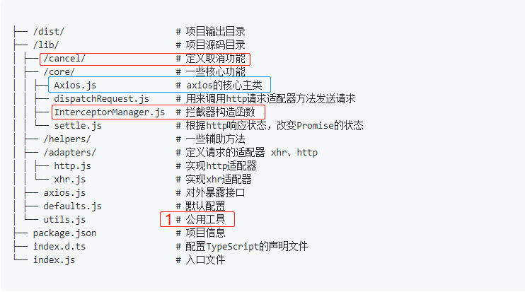

## axios目录结构



### utils工具函数

```js
module.exports = {
  isArray: isArray, 
  isArrayBuffer: isArrayBuffer, // 二进制字节数组 '[object ArrayBuffer]'
  isBuffer: isBuffer,
  isFormData: isFormData, // typeof val ==
  isArrayBufferView: isArrayBufferView,
  isString: isString,
  isNumber: isNumber,
  isObject: isObject,
  isPlainObject: isPlainObject, // 只有直接是Object的实例，或者null，才会返回true
  isUndefined: isUndefined,
  isDate: isDate, // '[object Date]'
  isFile: isFile, // '[object File]' File继承自Blob
  isBlob: isBlob, // // Binary Large Object的缩写，代表二进制类型的大对象
  isFunction: isFunction,
  isStream: isStream, // val.pipe 类似于函数组合compose
  isURLSearchParams: isURLSearchParams, // // key1=val1&key2=val2 query提取
  isStandardBrowserEnv: isStandardBrowserEnv,
  forEach: forEach,
  merge: merge, // 对象合并，相同属性'后'覆盖'前' merge(/* obj1, obj2, obj3, ... */)
  extend: extend, // 功能扩展 extend(a, b, thisArg) 扩展a
  trim: trim,
  stripBOM: stripBOM //移除开头的0xFEFF
};
```

